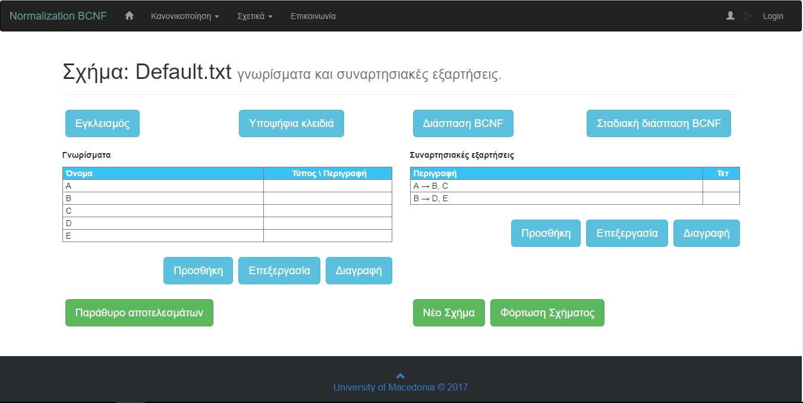
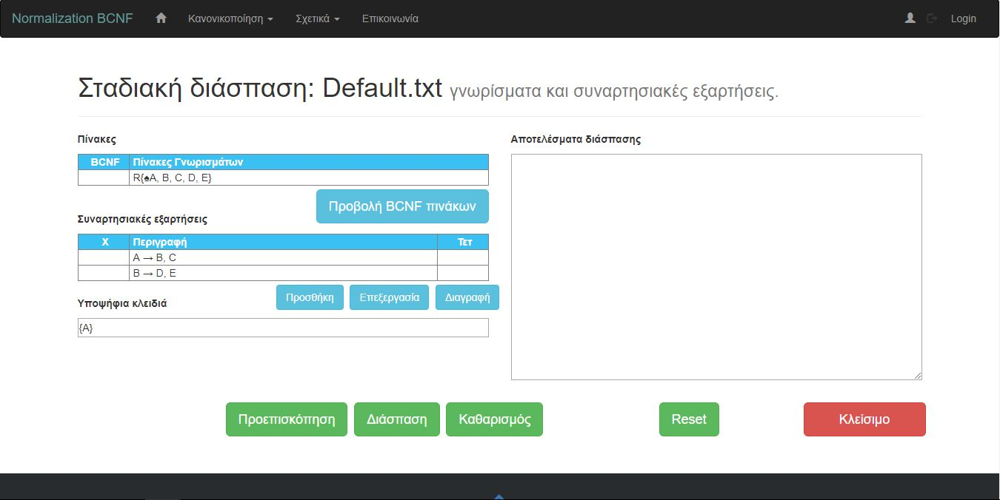
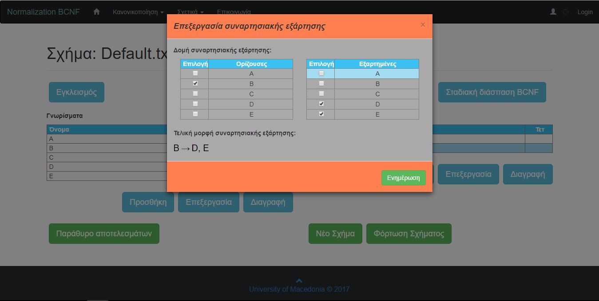
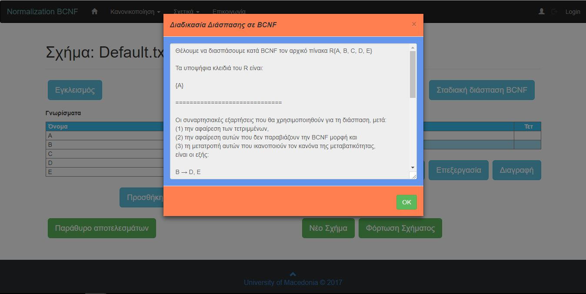
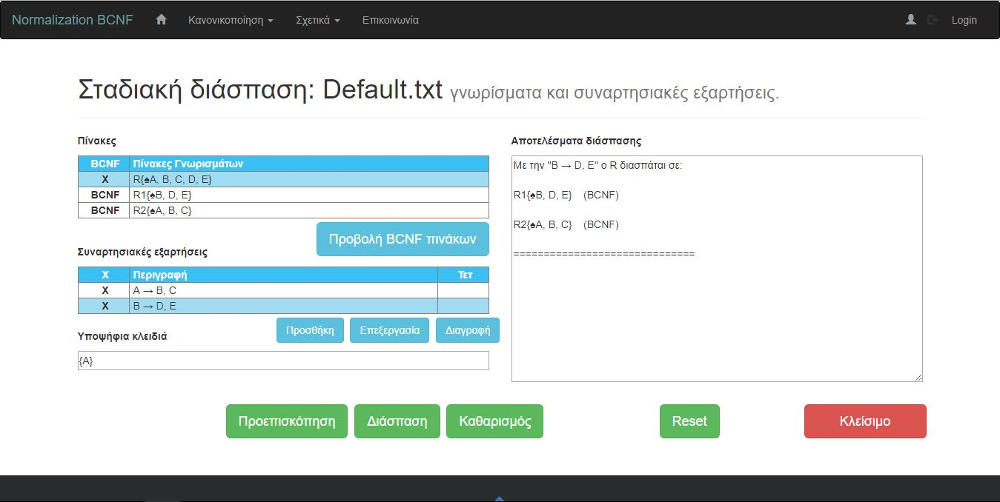
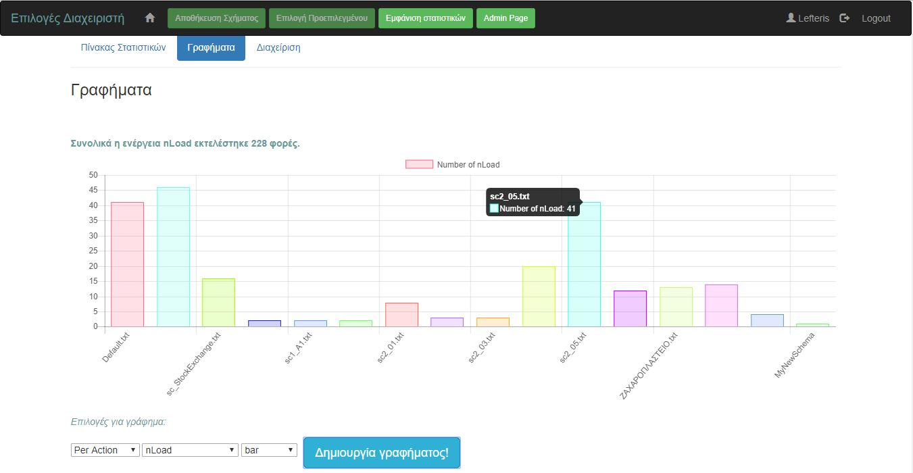
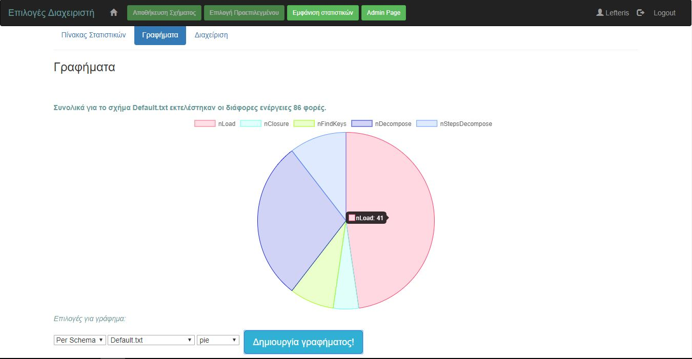
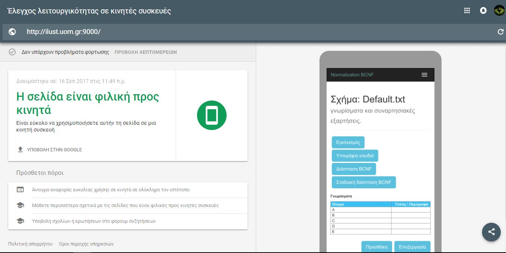
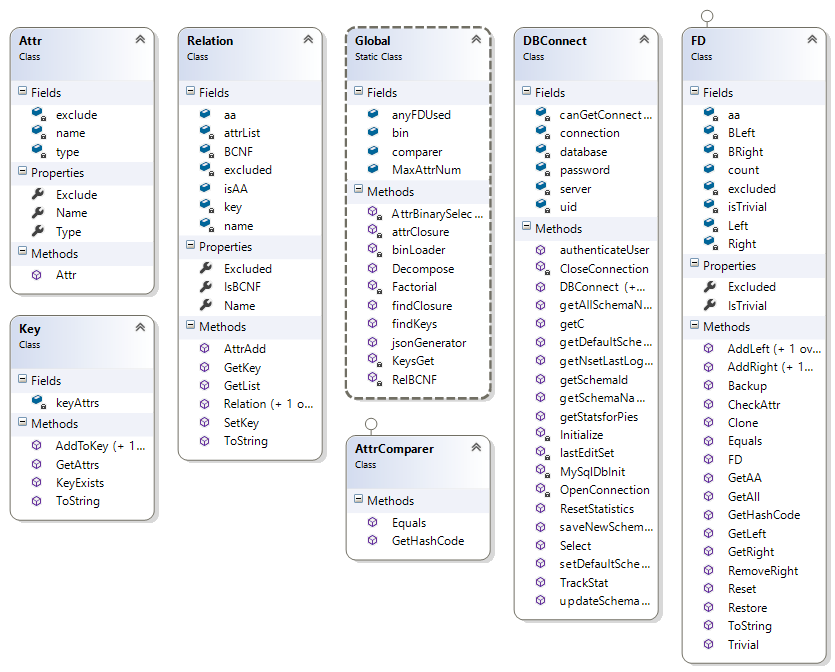

# NormToolBcnf

### My graduation thesis

### Theme: web application for Normalization in BCNF.

This is an academic Tool. It's purpose is to help students understand Normalization in BCNF. I started having given the code of a
windows application of Normalization, created by [Xristos Stefanidis](mailto:chstefanides@yahoo.gr).

The project is under the supervision of Lecturer [Georgia Koloniari](http://users.uom.gr/~gkoloniari/).

### Project Information:
The application can be accesed from http://ilust.uom.gr:9000/. 
Note: the application is not always on. For now, only some hours per day is running.

You can see the Document of Theseis [here](https://drive.google.com/file/d/0B9113-m76t9ZSW5PTy1uNkVvdGc/view).

Below are provided some screenshots of the application.
### Home Screen:

### Steps Decompose Screen:

### Feature Edit a Functional Dependency:

### An example on schema Decompose result:

### An example on schema Steps Decompose result:

### Admins can create Bar Charts to watch the metrics:

### Or a Pie Chart: 

### Made with Responsive Design:

### Class Diagram:

